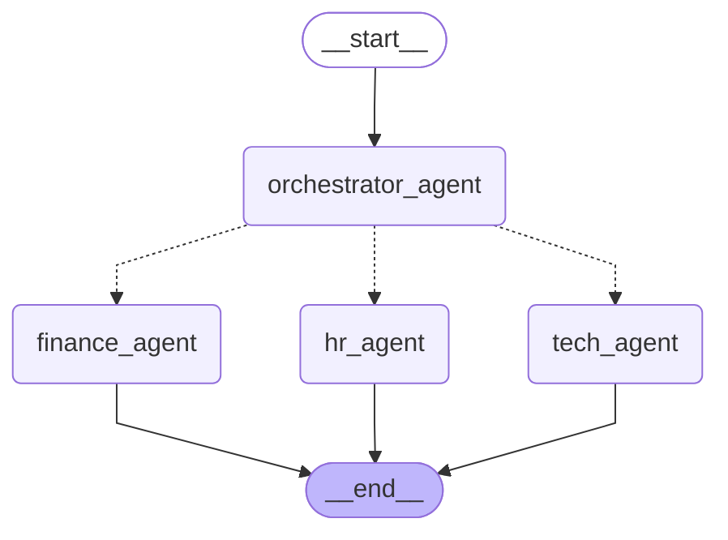

# Multi-Agent RAG Support System using LangGraph
## Project description
This project involves building a Multi-Agent Retrieval-Augmented Generation (RAG) Support System using LangGraph and Langfuse. The system consists of an Orchestrator Agent that classifies user queries into specific categories (e.g., HR, Tech, Finance) and routes them to specialized RAG Agents. Each RAG Agent is responsible for retrieving information from domain-specific document collections to provide accurate and context-aware responses. The entire workflow is implemented using LangGraph components, ensuring maintainability and observability through Langfuse integration.

### Project File Structure

```
.
├── chroma_db/                  # Directory to store Chroma vector databases
├── data/                       # Raw document collections for each domain (HR, Tech, Finance)
│   ├── finance_docs
│   │   └── finance.md
│   ├── hr_docs
│   │   └── hr.md
│   └── tech_docs
│       └── tech.md
├── multi_agent_system.ipynb    # Jupyter notebook implementing the multi-agent RAG system
├── README.md                   # Project documentation
└── requirements.txt            # Project dependencies
```


### Architecture
The project architecture can be visualized as follows:

### Technical Implementation Details
- **LangGraph**: The entire multi-agent workflow is implemented using LangGraph, which provides a structured way to define states and transitions between agents.
- **Orchestrator Agent**: This agent classifies user queries into predefined categories using a chat model. Based on the classification, it routes the query to the appropriate RAG Agent.
- **Specialized RAG Agents**: Each RAG Agent (HR, Tech, Finance) is implemented to handle domain-specific queries. They utilize Chroma for document retrieval and a chat model for generating responses.
- **Langfuse Integration**: The system is fully instrumented with Langfuse to provide observability, allowing engineers to trace the execution path, debug misclassifications, and monitor performance.
### Testing and Validation
The system is tested using a set of predefined user queries that cover various categories. Each query is processed through the multi-agent workflow, and the output state is printed in a highlighted JSON format for easy inspection.
### Future Enhancements
- **Automated Evaluation**: Implement an Evaluator Agent within Langfuse to automatically score the quality of responses based on relevance, completeness, and accuracy.
- **Expanded Document Collections**: Add more domain-specific document collections to enhance the knowledge base of each RAG Agent.
- **User Feedback Integration**: Incorporate mechanisms for users to provide feedback on responses, enabling continuous improvement of the agents.

## Setup instructions (install requirements, set API keys) 
1. Clone the repository to your local machine.
2. Install the required dependencies using pip:
   ```bash
   pip install -r requirements.txt
   ```
3. Set up environment variables for API keys and configurations. Create a `.env` file in the root directory with the following content:
   ```env
   EMBEDDING_MODEL=your_embedding_model
   COMPLETION_MODEL=your_completion_model
   LANGFUSE_SECRET_KEY=your_langfuse_secret_key
   LANGFUSE_PUBLIC_KEY=your_langfuse_public_key
   LANGFUSE_BASE_URL=your_langfuse_base_url
   ```
## How to run notebook (cell execution order) 
Run the notebook `multi_agent_system.ipynb` from top to bottom, ensuring that all cells are executed in order. The notebook is organized into sections for setup, document loading, agent definitions, orchestrator routing, testing, and Langfuse integration.

For the first run, create the vector databases by uncommenting the relevant cell in the "Document loading and vector stores" -> "Build the Vector Stores" subsection. After the initial setup, you can comment it back to avoid recreating the databases on subsequent runs.

## Usage examples (which cells to run) 
You can find 10 test examples under the "Testing & examples" section of the notebook. To run these examples, execute the cell that iterates through the `test_queries` list. This will invoke the multi-agent system for each query and print the output state in a highlighted JSON format.

You can invoke a single query by running the following code snippet in a new cell, the query returns a `state` object that contains the classification, retrieved documents, and generated answer:

```python
query = "Your test query here"
state = chain.invoke(State(user_query=query))
```

Print a pygmentized output of the state object:

```python
print_highlighted_json(state)
```
## Configuration notes 

You can change the embedding and completion models used in the system by modifying the `.env` file or directly updating the variables in the notebook setup section:

```env
EMBEDDING_MODEL="text-embedding-3-small"
COMPLETION_MODEL="gpt-4.1-mini"
```

## Known limitations.
- The system currently supports only three specialized RAG Agents (HR, Tech, Finance). Expanding to additional domains may require further development and testing.
- The classification accuracy of the Orchestrator Agent is dependent on the quality of the training data and the capabilities of the underlying chat model.
- The document retrieval performance is influenced by the size and quality of the document collections used for each RAG Agent.
- The Langfuse integration provides basic observability, but more advanced monitoring and alerting features could be implemented for production environments.
